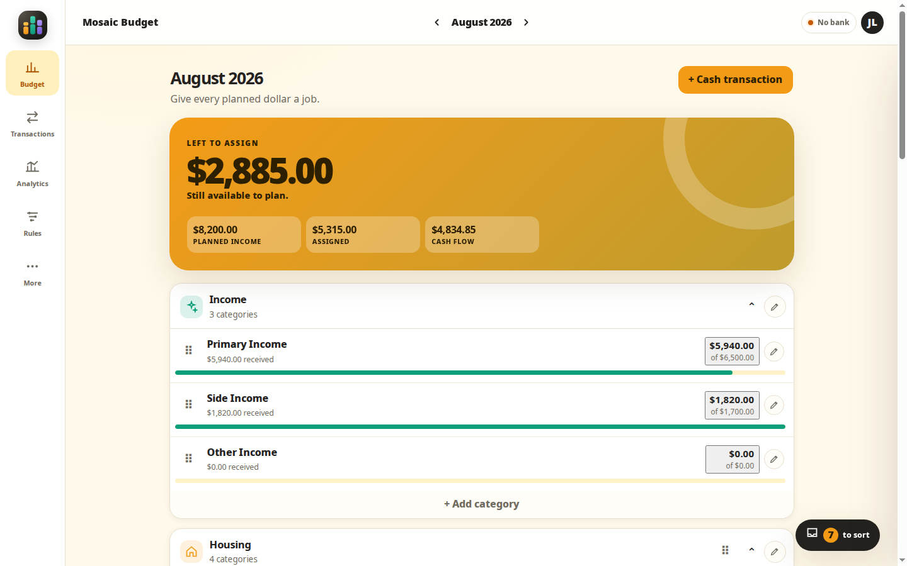
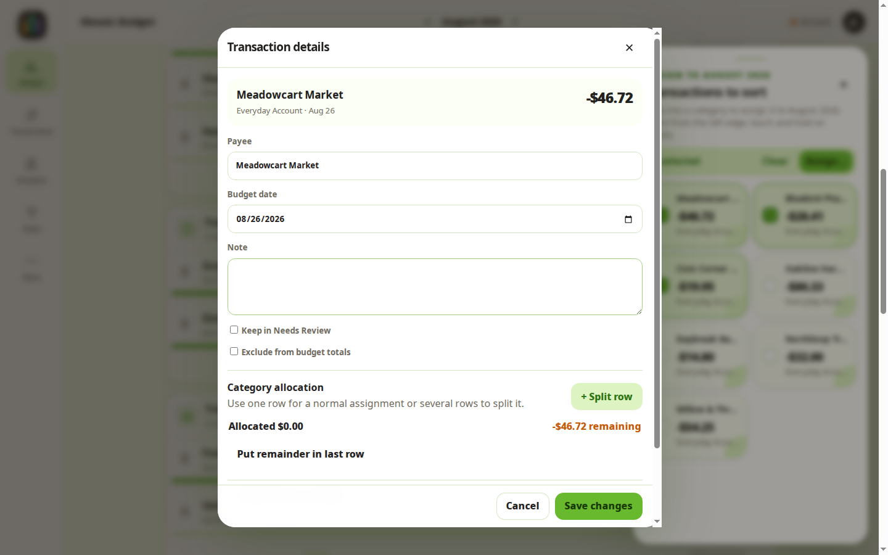
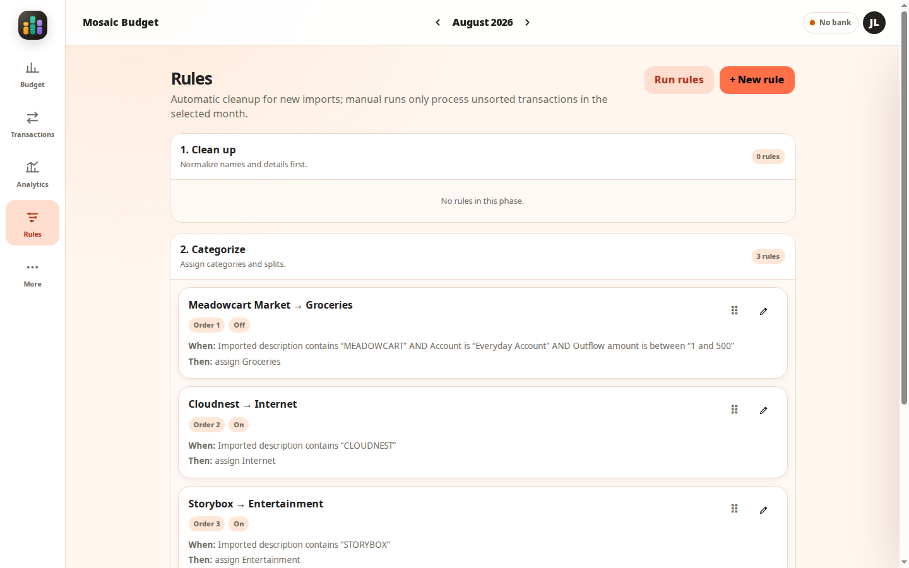
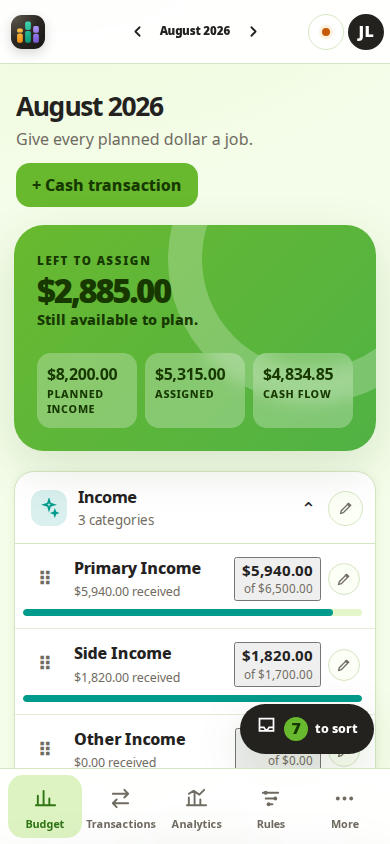
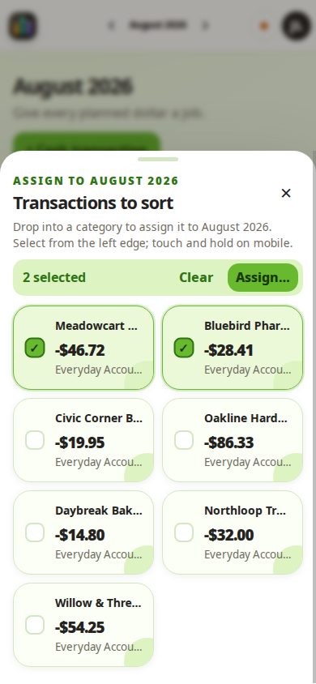

<p align="center">
  
</p>

<h1 align="center">Mosaic Budget</h1>

<p align="center">
  A calm, self-hosted monthly budget with automatic SimpleFIN sync.
</p>

<p align="center">
  <a href="https://github.com/diskchord/mosaic-budget/actions/workflows/ci.yml"></a>
  <a href="LICENSE"></a>
</p>

Mosaic turns incoming transactions into a clear, visual plan for the month. Sort
on a phone, automate the repetitive parts, and keep the original financial
record intact. The whole application runs on infrastructure you control.

## See Mosaic

<p align="center">
  <a href="artifacts/mosaic-screenshots/01-budget-desktop-citrus.png">
    
  </a>
</p>

<p align="center"><sub>Plan the month at a glance, then arrange sections and categories around the way your household thinks.</sub></p>

| Inspect without leaving the sort | Put rules in deterministic order |
| :---: | :---: |
| [](artifacts/mosaic-screenshots/05-sort-inspection-desktop-meadow.png) | [](artifacts/mosaic-screenshots/07-rules-desktop-sunrise.png) |
| Open a candidate's full transaction window, then cancel back to the tray with the selection intact. | See every phase, then drag rules into the exact order Mosaic should run them. |

<p align="center">
  <a href="artifacts/mosaic-screenshots/10-budget-mobile-meadow.png"></a>
  <a href="artifacts/mosaic-screenshots/11-sort-tray-mobile-meadow.png"></a>
</p>

<p align="center"><sub>The same responsive workflow runs as an installable PWA and in the Android companion.</sub></p>

<p align="center">
  <a href="artifacts/mosaic-screenshots/00-contact-sheet.png">View all screenshots</a>
  ·
  <a href="artifacts/Mosaic-Screenshot-Pack.zip">Download the screenshot pack</a>
</p>

All names, transactions, account labels, and amounts shown above are synthetic
demo data.

## Highlights

- **A budget that fits real months.** Plan income and expenses, carry fund
  balances forward, and start, pause, or end categories without rewriting
  history. Drag sections and categories into the order that matches your plan.
- **A fast transaction inbox.** Check several transactions and drag them as a
  group, inspect one without losing your place in the sort, tap to categorize
  or split to the exact cent, and record cash or manual activity.
- **Useful automation.** Build deterministic rules, preview their matches, or
  run the complete ruleset manually against only the selected month's unsorted
  transactions. Arrange rules within each execution phase by dragging them.
- **Conservative bank sync.** SimpleFIN credentials are encrypted at rest;
  imports keep an append-only source history and reconcile pending transactions
  without silently discarding ambiguous records.
- **Duplicate-feed protection.** Mark redundant imported accounts as duplicates
  to remove double-counted transactions while preserving the source ledger.
- **Built for a household.** Multiple users, optimistic conflict detection,
  audit events, operational alerts, verified backups, and an installable
  mobile-first PWA are included.

## Quick start

You need Docker Engine and Docker Compose v2.

```bash
git clone https://github.com/diskchord/mosaic-budget.git
cd mosaic-budget
cp .env.example .env
make secrets
```

Paste the three generated values into `.env`, then replace the bootstrap
administrator email, name, and password. Every `CHANGE_ME` value must be
changed.

```bash
make up
```

Open [http://localhost:8080](http://localhost:8080). The first startup applies
the database migrations and creates the owner account and starter budget.

Want to try the same synthetic workspace shown above?

```bash
make demo
```

The demo is idempotent, but it writes sample data into the active workspace. Use
it only on a new or disposable installation.

## Android companion

The `android/` project packages the complete responsive Mosaic interface in a
hardened native shell. It keeps the touch-and-hold transaction drag workflow,
all seven themes, live updates, analytics, rules, and owner tools in sync with
the remote server rather than maintaining a separate mobile implementation.

```bash
cd android
./gradlew :app:assembleDebug
adb install -r app/build/outputs/apk/debug/app-debug.apk
```

On first launch, enter the HTTPS root origin of the Mosaic server, then sign in
with that server's email and password. The APK stores only the server origin;
credentials go directly to the server and the session remains in private
first-party WebView storage. See the [Android guide](android/README.md) for
release signing and deployment requirements.

## Connect a bank

SimpleFIN is optional; Mosaic also works with manual transactions.

1. Sign in as the owner and open **More**.
2. Choose **Connect SimpleFIN** under **Bank connections**.
3. Paste a newly generated setup token.
4. Let the worker perform the first import.

The setup token is claimed once. Mosaic stores only the returned Access URL,
encrypted with `APP_ENCRYPTION_KEY`. See the
[SimpleFIN guide](docs/SIMPLEFIN.md) for polling, reconciliation, and failure
behavior.

## Run it safely

Financial data deserves production-grade care. Before exposing Mosaic outside a
trusted private network:

- terminate HTTPS at a reverse proxy;
- set `COOKIE_SECURE=true` and an exact `TRUSTED_HOSTS` value;
- store backups off the Docker host and run `make backup`;
- preserve `APP_ENCRYPTION_KEY` separately from the database; and
- configure notifications and an external heartbeat.

Start with the [operations guide](docs/OPERATIONS.md) and
[deployment security guide](docs/SECURITY.md). An example reverse-proxy
configuration is available in [ops/Caddyfile.example](ops/Caddyfile.example).

## Development

The backend uses FastAPI, SQLAlchemy, Alembic, and PostgreSQL. The frontend is a
small progressive web app with no JavaScript build step.

```bash
python3 -m venv .venv
. .venv/bin/activate
python -m pip install -r backend/requirements.txt -r backend/requirements-dev.txt
make verify
```

`make verify` compiles the Python modules, checks the browser JavaScript, and
runs the complete test suite. With Docker available, `make test` runs the
tests in the application container.

| Command | Purpose |
| --- | --- |
| `make up` | Build and start Mosaic |
| `make logs` | Follow application and backup logs |
| `make ps` | Show service health and status |
| `make test` | Run tests in Docker |
| `make verify` | Run local static checks and tests |
| `make android-apk` | Build the installable debug Android APK |
| `make android-lint` | Run Android lint against the companion app |
| `make android-check` | Test, build, and lint the Android companion |
| `make backup` | Create and restore-verify a database backup |
| `make demo` | Add sample data to a new workspace |
| `make down` | Stop Mosaic without deleting its data volume |

Interface screenshots must use a disposable workspace with synthetic data.
Run `node scripts/capture-screenshots.js --help` for the capture workflow;
`python3 scripts/build-screenshot-pack.py --check` verifies that the contact
sheet and downloadable pack match the source images.

## Documentation

| Guide | What it covers |
| --- | --- |
| [User guide](docs/USER_GUIDE.md) | Budgeting, sorting, rules, and duplicate accounts |
| [SimpleFIN](docs/SIMPLEFIN.md) | Bank connection and synchronization behavior |
| [Operations](docs/OPERATIONS.md) | Deployment, monitoring, backups, and recovery |
| [Architecture](docs/ARCHITECTURE.md) | Data model, integrity guarantees, and runtime design |
| [Security](docs/SECURITY.md) | Threat model and deployment controls |
| [Validation](docs/VALIDATION.md) | Automated and staging verification record |
| [Changelog](CHANGELOG.md) | Released and unreleased changes |

Mosaic is deliberately online-first: it does not queue financial writes while
offline. Transfer pairing and formal account reconciliation are not yet complete
accounting subsystems. Stage the application and verify backups before trusting
it with the only copy of financial data.

## Contributing and security

Contributions are welcome; see [CONTRIBUTING.md](CONTRIBUTING.md). Please report
security problems privately according to [SECURITY.md](SECURITY.md), and never
post live credentials or real financial data in an issue.

## License

Mosaic Budget is licensed under the [Apache License 2.0](LICENSE).
